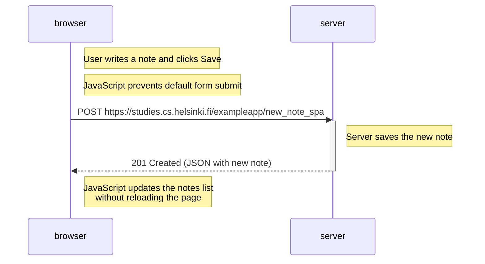

```mermaid
sequenceDiagram
    participant browser
    participant server

    Note right of browser: User writes a note and clicks Save

    Note right of browser: JavaScript prevents default form submit

    browser->>server: POST https://studies.cs.helsinki.fi/exampleapp/new_note_spa
    activate server
    Note right of server: Server saves the new note
    server-->>browser: 201 Created (JSON with new note)
    deactivate server

    Note right of browser: JavaScript updates the notes list<br/>without reloading the page
```
